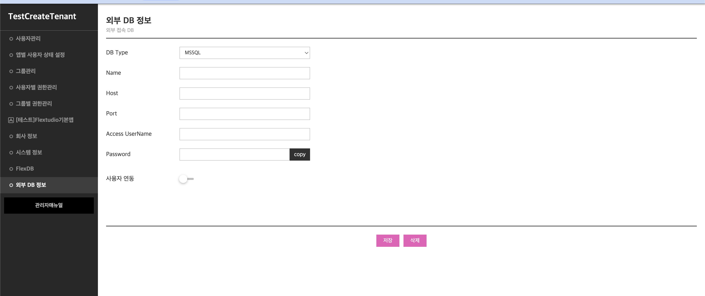
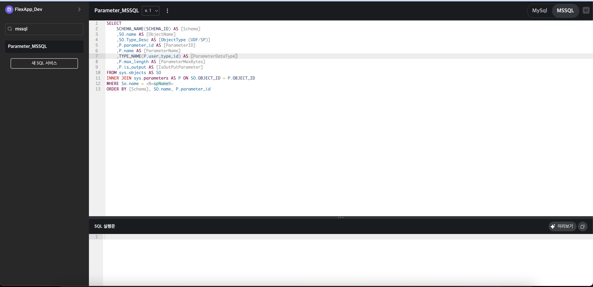

# MSSQL 연동 기능 추가 (Flextudio)

🔥 **기간**: 2023/03/10 → 2023/03/17  
🛠 **기술 스택**: Node.js, MSSQL, MySQL, DynamoDB, JavaScript  
🏢 **회사**: Flextudio  

---

## 📝 프로젝트 개요
Flextudio의 기존 DB 연결 기능은 **MySQL만 지원**했지만, 기업 고객 중 **MSSQL을 사용하는 사례가 많아** 이를 지원할 필요가 있었습니다.  
**B2B 고객을 타겟팅**하여 MSSQL 연결 기능을 추가하고, UI 및 백엔드 로직을 개선하는 작업을 수행했습니다.  

✅ **기여한 부분**  
- **DB 연결 옵션 확장** → 기존 MySQL만 지원하던 기능을 MSSQL까지 확장  
- **MSSQL 연결을 위한 백엔드 로직 추가** → `mssql` 패키지를 활용한 연결 구현  
- **DB 타입 선택 UI 개선** → MySQL / MSSQL을 선택하면 동적으로 입력 필드 변경  
- **DynamoDB 저장 방식 개선** → 각 DB 연결 정보를 안전하게 저장 및 삭제 가능  

---

## 🚀 주요 기능

### ✅ 1. MySQL & MSSQL 선택 UI 추가
- 사용자가 **DB 연결 유형(MySQL, MSSQL)을 선택할 수 있도록 UI 추가**
- 선택된 DB 유형에 따라 **입력 필드가 자동 변경**되도록 구현

### ✅ 2. MSSQL 연결 기능 추가
- MSSQL 연결을 위한 **Node.js `mssql` 패키지 활용**
- MySQL과 MSSQL의 **커넥션 방식 차이를 고려하여 로직 분리**
- MSSQL의 인증 방식 (SQL Server 인증 vs. Windows 인증) 고려하여 **SQL Server 인증 방식 적용**

### ✅ 3. DB 정보 저장 및 삭제 기능
- DynamoDB에 **DB 연결 정보(MySQL, MSSQL) 저장**
- 필요 시 DB 정보를 안전하게 삭제할 수 있도록 구현  

### ✅ 4. MSSQL 쿼리 실행 기능 추가
- MySQL뿐만 아니라 **MSSQL에서도 SQL을 실행할 수 있도록 기능 추가**  
- 실행된 쿼리는 `_fFlexSQLService` 테이블의 `fScript_mssql` 필드에 저장됨  

---

## 🛠 사용 기술
| 기술 | 설명 |
|------|------|
| **Node.js (Express.js)** | API 개발 |
| **MSSQL** | 데이터 저장 및 조회 |
| **MySQL** | 기존 지원 DB |
| **DynamoDB** | DB 연결 정보 저장 |
| **JavaScript (React UI)** | 프론트엔드 개발 |
| **SQL (`mssql` 패키지)** | MSSQL 연결 및 쿼리 실행 |

---

## 🔍 시스템 아키텍처
```plaintext
사용자 → DB 연결 선택 (MySQL / MSSQL) → DynamoDB 저장 → MSSQL 연동 → SQL 실행 가능
```

---

## 📌 B2B 타겟 고객을 위한 확장
### **🔹 기존 고객의 Pain Point 해결**
- 기존 서비스는 **MySQL만 지원**하여 **MSSQL을 사용하는 기업 고객**이 서비스를 활용할 수 없었음
- **MSSQL 지원을 추가하면서, 더 많은 기업 고객이 서비스에 유입될 수 있도록 개선**

### **🔹 기업 고객을 고려한 확장성**
- 대기업 및 금융권에서는 MSSQL을 많이 사용하므로, **B2B SaaS 타겟팅을 확장**하는 효과  
- 앞으로 **PostgreSQL, Oracle 등 추가적인 DB 연결 기능을 고려할 수 있는 기반을 마련**  

---

## 📸 프로젝트 UI 화면



---

## 🔍 코드 샘플

### **🔹 MSSQL 연결 설정**
```javascript
const sql = require('mssql');

async function connectMSSQL(dbConfig) {
    try {
        const pool = await sql.connect(dbConfig);
        console.log('✅ MSSQL 연결 성공');
        return pool;
    } catch (err) {
        console.error('❌ MSSQL 연결 실패:', err);
        throw err;
    }
}

const dbConfig = {
    user: 'username',
    password: 'password',
    server: 'hostname',
    database: 'dbName',
    port: 1433,
    options: {
        encrypt: true,
        enableArithAbort: true
    }
};

// 연결 테스트
connectMSSQL(dbConfig).then(pool => {
    console.log('DB 연결 성공');
}).catch(err => {
    console.error(err);
});
```

---

### **🔹 MySQL & MSSQL 선택 UI 구현**
```javascript
function updateDBFields(selectedDBType) {
    const mssqlFields = document.getElementById('mssql-fields');
    const mysqlFields = document.getElementById('mysql-fields');

    if (selectedDBType === 'MSSQL') {
        mssqlFields.style.display = 'block';
        mysqlFields.style.display = 'none';
    } else {
        mssqlFields.style.display = 'none';
        mysqlFields.style.display = 'block';
    }
}

document.getElementById('dbTypeSelect').addEventListener('change', (event) => {
    updateDBFields(event.target.value);
});
```

---

## 🚀 배운 점 & 개선할 점
✅ **배운 점**:
- **MSSQL과 MySQL의 차이점 이해**  
- **Node.js에서 `mssql` 패키지를 활용하여 데이터베이스 연동하는 방법 학습**  
- **B2B SaaS에서 다양한 DB 지원이 중요한 이유를 경험**  

🔧 **개선할 점**:
- **향후 PostgreSQL, Oracle 같은 추가적인 DB 지원 기능 고려 가능**  
- **UI에서 DB 연결 정보를 더 직관적으로 입력할 수 있도록 개선 가능**  
- **DB 연결 실패 시, 더 친절한 오류 메시지를 제공하는 기능 추가 가능**  

---