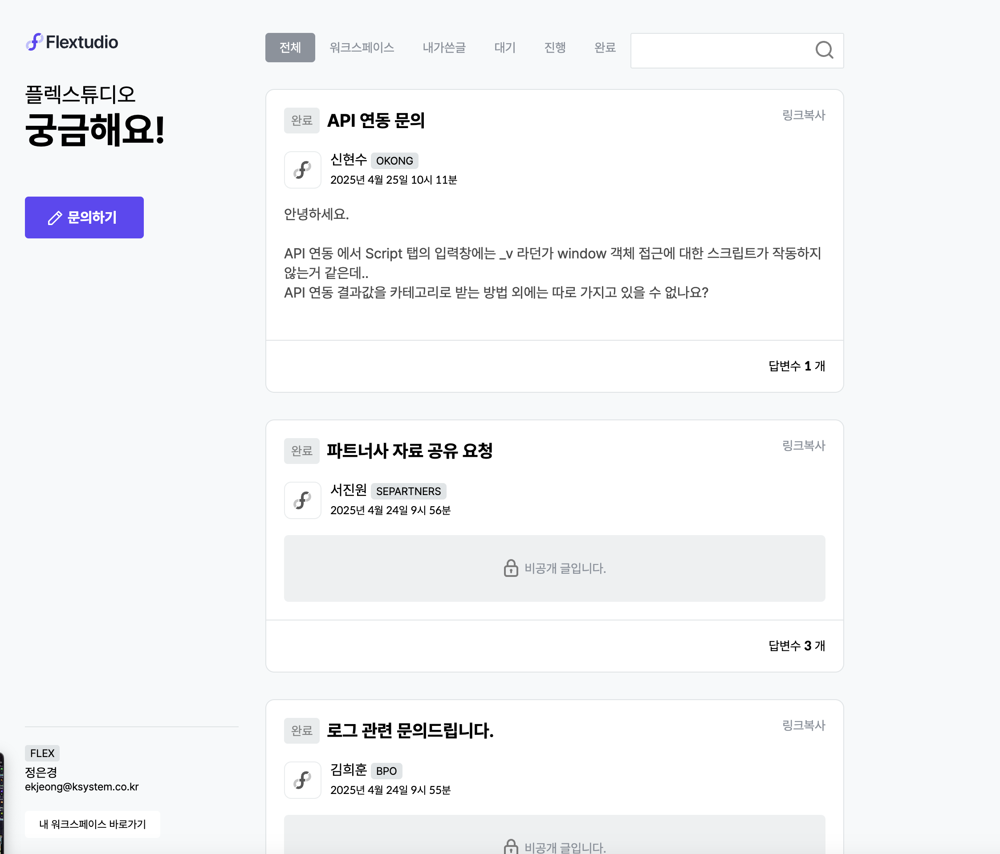
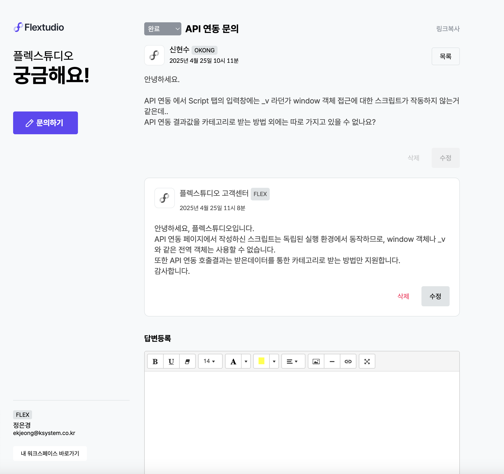

### 📌 **Q&A 서비스 개발 (Flextudio)**  

🛠 **기간**: 2023/04/10 → 2023/05/05  
🏢 **회사**: Flextudio  
💡 **누적 질문 수**: **967개** (도입 이후 활성화)  
🌐 **기술 스택**: Node.js, DynamoDB, AWS S3, Express  

---

## 🚀 **1. 프로젝트 개요**  
Flextudio 내 사용자의 문의 해결을 위한 **Q&A 시스템**을 설계하고 개발했습니다.  
이를 통해 **내부 사용자 및 고객이 빠르게 질문을 등록하고, 효율적으로 답변을 받을 수 있도록 개선**했습니다.  

✅ **주요 기여 사항**  
- **워크스페이스 기반의 Q&A 시스템 설계 및 개발**  
- **페이지네이션 적용 → 목록 조회 속도 최적화**  
- **검색 기능 개선 → DynamoDB 기반 키워드 검색 최적화**  
- **AWS S3 활용한 이미지 업로드 지원**  

---

## 🛠 **2. 사용 기술 및 시스템 설계**  
### 🔹 **사용 기술**  
| 기술 | 설명 |
|------|------|
| **Node.js (Express)** | API 및 백엔드 라우팅 |
| **DynamoDB** | 질문 및 답변 데이터 저장 |
| **AWS S3** | 이미지 업로드 및 저장 |
| **Summernote** | WYSIWYG 에디터 활용 |

### 🔹 **데이터 모델링 (DynamoDB)**
| 컬럼 명 | 설명 |
|---------|----------------|
| **fWorkspace** | 워크스페이스 이름 (파티션 키) |
| **Timestamp** | 작성 시간 (정렬 키) |
| **title** | 질문 제목 |
| **content** | 질문 본문 |
| **private** | 비밀글 여부 |
| **userID** | 작성자 ID |
| **userName** | 작성자 이름 |
| **qKey** | 질문과 답변 연결 키 |
| **searchTxt** | 질문 제목, 본문, 답변 내용을 포함한 압축 검색 필드 |

---

## 🎯 **3. 성능 개선 및 최적화**
### ✅ **1) 빠른 목록 조회 (페이지네이션 적용)**
- **기존 문제:** 모든 질문을 한 번에 가져오는 방식 → 성능 저하 발생  
- **해결 방법:** **20개씩 "더보기" 버튼을 통해 추가 호출 (Lazy Loading 방식)**  
- **결과:** **응답 속도 개선** 및 **리스트 렌더링 부담 감소**

### ✅ **2) DynamoDB 기반 키워드 검색 최적화**
- **문제점:** DynamoDB의 특성상 범용적인 검색(Query) 지원이 제한적  
- **해결 방법:**  
  - **searchTxt 필드 추가** → title, content, 답변 내용을 하나의 필드에 저장  
  - **GSI (Global Secondary Index) 활용** → 특정 키워드 검색 최적화  
- **결과:** 전체 테이블 스캔 대신 **부분 인덱스 조회로 검색 속도 최적화**  

### ✅ **3) 다중 답변 기능 추가**
- **기존 문제:** 한 명만 답변 가능 → 해결 속도 저하  
- **해결 방법:** **모든 사용자가 답변 가능하도록 변경**  
- **결과:** 질문당 평균 답변 수 증가, **Q&A 활성화 (누적 질문 967개 기록)**

---

## 📸 **4. 프로젝트 UI**

---

## 🔍 **5. 배운 점 & 성과**
✅ **DynamoDB를 활용한 빠른 데이터 조회 및 설계 경험**  
✅ **워크스페이스 기반의 다중 사용자 지원 시스템 구축**  
✅ **Q&A 활성화를 위한 UX 개선 및 성능 최적화 적용**  
✅ **AWS S3를 활용한 이미지 업로드 기능 개발 경험**  

---

## 📌 **6. 개선할 점**
🔹 **질문 검색 최적화**: 검색 필터 개선하여 질문 탐색을 더 빠르게 만들 예정  
🔹 **답변 추천 시스템 추가**: 유용한 답변을 상위 노출하도록 개선 가능  

---

## 🎯 **7. 검색 성능 개선 계획**
현재 **searchTxt 필드와 GSI(Global Secondary Index)**를 활용하여 검색 성능을 최적화하였으나,  
더욱 고도화된 검색 기능을 제공하기 위해 **향후 AWS OpenSearch (Elasticsearch) 도입을 고려하고 있습니다.**  

✅ **Elasticsearch 도입 배경**  
- **Full-text Search 지원** → 띄어쓰기 무관 검색, 유사어 검색 가능  
- **고속 검색 성능** → DynamoDB Scan 방식 대비 빠른 응답 속도 제공  
- **향후 추천 시스템 연계 가능** → 사용자 선호도 기반 검색 결과 제공  

✅ **단계별 개선 계획**  
1️⃣ **단기**: 현재 DynamoDB의 GSI 기반 검색 최적화 유지  
2️⃣ **중기**: OpenSearch 연동하여 복잡한 검색 쿼리 최적화  
3️⃣ **장기**: 검색 결과의 가중치 및 추천 시스템 적용 검토  

---

## 🎯 **8. 결론**
Flextudio의 Q&A 시스템을 직접 설계 및 개발하여 **누적 967개의 질문이 등록**될 정도로 높은 활용도를 기록했습니다.  
이 프로젝트를 통해 **데이터 최적화, 보안 강화, 사용자 경험 개선**을 성공적으로 수행했으며,  
지속적인 개선을 통해 더 나은 서비스를 제공할 계획입니다. 🚀  

특히, 검색 기능의 확장을 위해 **AWS OpenSearch (Elasticsearch) 도입을 검토 중이며**,  
이를 통해 **더욱 정교하고 빠른 검색 서비스 제공**을 목표로 하고 있습니다.