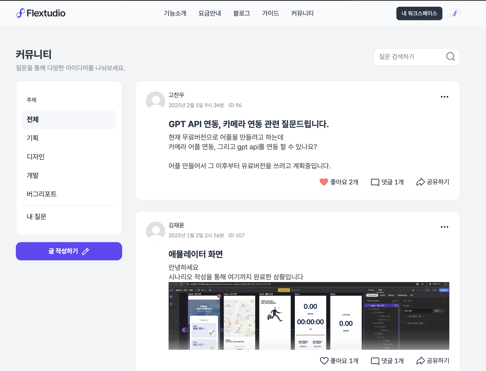
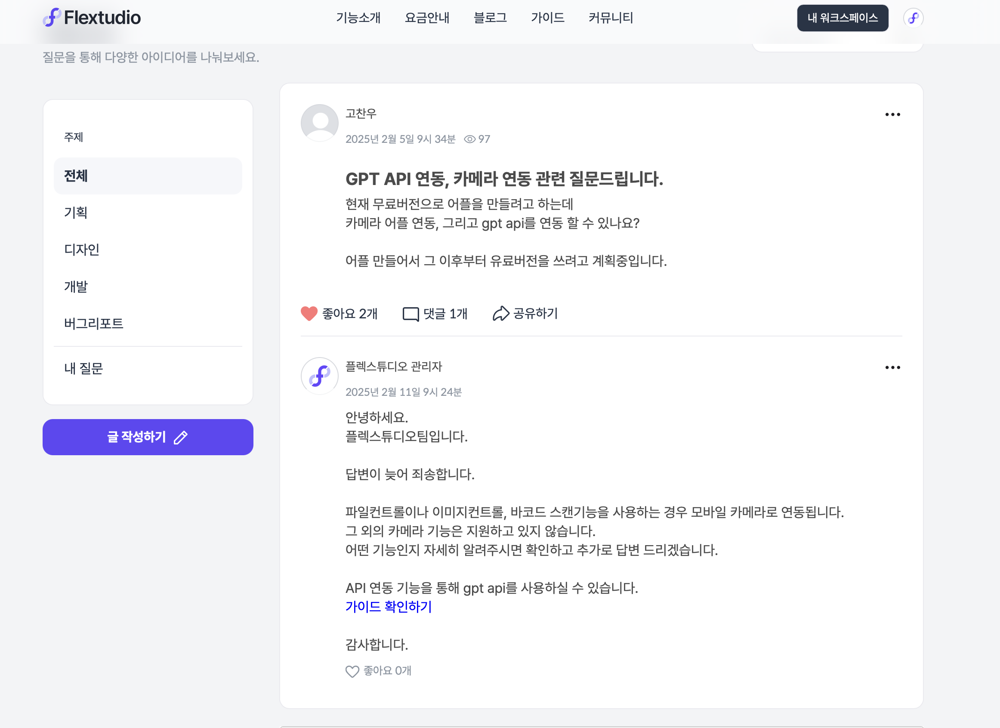

### 📌 **통합 회원가입 및 커뮤니티 기능 개발 (Flextudio)**  

🛠 **기간**: 2024/05/01 → 2024/06/15  
🏢 **회사**: Flextudio  
🌐 **기술 스택**: Node.js, DynamoDB, Express  

---

## 🚀 **1. 프로젝트 개요**  
기존 Flextudio의 **워크스페이스별 개별 회원가입 방식**을 **통합 회원가입 시스템**으로 개선하여,  
하나의 계정으로 여러 워크스페이스를 쉽게 이용할 수 있도록 개발했습니다.  

또한, 기존 Q&A 시스템을 확장하여 **커뮤니티 기능을 구축**함으로써  
사용자 간 **정보 공유 및 협업을 더욱 활성화**했습니다.  

✅ **주요 기여 사항**  
- **워크스페이스 단위의 개별 회원가입 → 통합 회원가입 시스템으로 전환**  
- **DynamoDB 기반의 사용자 관리 시스템 설계 및 최적화**  
- **Q&A 시스템을 확장하여 커뮤니티 형태로 개선**  
- **주제별 게시판 및 버그 리포트 기능 추가**  
- **좋아요, 댓글, 공유 기능 추가**  

---

## 🛠 **2. 사용 기술 및 시스템 설계**  
### 🔹 **사용 기술**  
| 기술 | 설명 |
|------|------|
| **Node.js (Express)** | API 및 백엔드 라우팅 |
| **DynamoDB** | 사용자 및 게시글 데이터 저장 |
| **AWS S3** | 프로필 이미지 및 첨부파일 저장 |
| **Frontend (기존 시스템 활용)** | UI 및 인터페이스 유지 |

### 🔹 **데이터 모델링 (DynamoDB)**
#### **_fFlextudioMember (회원 데이터)**
| PK | 컬럼 명 | 설명 |
|---|---|---|
| userID | fEmail | 사용자 이메일 |
|  | fPassword | 비밀번호 |
|  | fName | 사용자 이름 |
|  | fWorkspaces | 소속된 워크스페이스 목록 |
|  | fStatus | 활성화/휴면/탈퇴 상태 |

#### **_fCommunity (커뮤니티 데이터)**
| PK | 컬럼 명 | 설명 |
|---|---|---|
| fEmail#Timestamp | Title | 게시글 제목 |
|  | Content | 게시글 내용 |
|  | Category | 주제 (기획, 디자인, 개발 등) |
|  | view | 조회수 |
|  | searchTxt | 검색 최적화 텍스트 |

#### **_fComments (댓글 데이터)**
| PK | SK | 컬럼 명 |
|---|---|---|
| email#timestamp | timestamp | Content (댓글 내용) |
|  |  | like (좋아요 개수) |
|  |  | isSelected (채택 여부) |

---

## 🎯 **3. 주요 개선 사항**
### ✅ **1) 통합 회원가입 및 로그인 시스템**
- **기존 문제:**  
  - 기존에는 **각 워크스페이스마다 개별적으로 회원가입을 해야 함** → 관리 및 사용성이 불편  
- **해결 방법:**  
  - 하나의 계정으로 **모든 워크스페이스를 관리할 수 있도록 개선**  
  - 통합 로그인 시스템 적용 → 기존 계정도 통합 계정으로 전환  
  - 인증 이메일을 통한 계정 활성화 및 보안 강화  
- **결과:**  
  - 사용자 편의성 향상 → 로그인 한 번으로 모든 워크스페이스 접근 가능  

---

### ✅ **2) 커뮤니티 기능 추가 (Q&A 확장)**
- **기존 문제:**  
  - 기존 Q&A 시스템은 질문/답변만 가능하여 자유로운 정보 공유가 어려움  
- **해결 방법:**  
  - 기존 Q&A 시스템을 확장하여 **주제별 게시판 추가** (기획, 디자인, 개발, 버그 리포트)  
  - **좋아요, 댓글, 공유 기능 추가**하여 사용자 참여도 증대  
  - **비밀글 기능 도입** (본인과 관리자만 조회 가능)  
- **결과:**  
  - **약 967개의 질문이 등록**, 사용자 간 자발적인 해결 및 정보 공유 증가  

---

### ✅ **3) 사용자 경험 개선 및 운영 효율성 증가**
- **기존 문제:**  
  - 버그 리포트 기능이 없어, 사용자 피드백이 흩어져 관리가 어려움  
- **해결 방법:**  
  - **버그 리포트 전용 게시판 추가**하여 개발팀이 사용자 피드백을 직접 받을 수 있도록 개선  
  - 관리자가 중요도를 설정하고, 진행 상태를 업데이트할 수 있는 기능 추가  
- **결과:**  
  - **사용자와 개발팀 간 커뮤니케이션 효율성 증가**, 유지보수 용이성 개선  

---

## 📸 **4. 프로젝트 UI**

---

## 🔍 **5. 배운 점 & 성과**
✅ **DynamoDB 기반의 대규모 데이터 모델링 및 최적화 경험**  
✅ **기존 Q&A 시스템을 확장하여 커뮤니티로 발전시키는 과정에서 사용자 니즈 분석 및 UX 개선 경험**  
✅ **회원가입 및 로그인 시스템 개선을 통한 보안 강화 및 운영 효율성 증가**  
✅ **버그 리포트 기능 추가로 서비스 품질 개선 및 사용자 피드백 반영 체계화**  

---

## 📌 **6. 개선할 점**
🔹 **게시판 내 인기 글 추천 알고리즘 적용**  
🔹 **워크스페이스 간 협업 기능 추가 (예: 공유 프로젝트, 팀 커뮤니케이션 연동)**  

---

## 🎯 **7. 결론**
기존 Flextudio의 **워크스페이스별 회원가입 시스템을 통합하여 로그인 편의성을 향상**시키고,  
**Q&A 시스템을 커뮤니티로 확장하여 사용자 간 정보 공유를 촉진**하였습니다.  

이 프로젝트를 통해 **사용자 인증, 데이터 관리, UX 최적화, 커뮤니티 활성화**를 성공적으로 수행하였으며,  
추후 **더 나은 협업 기능을 추가하여 지속적으로 개선해 나갈 예정입니다. 🚀**  
